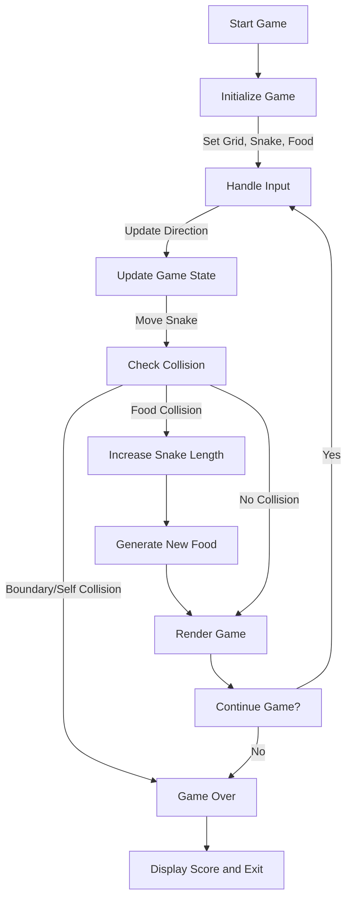

# Review of Existing Systems and Further Research
- By: **Shudarsan Regmi**


---
*Source*: ChatGPT

### Diagram



### 1. **Define the Game Structure**
   - Represent the game components (snake, food, and grid).
   - Use structs for better organization:
     ```c
     typedef struct {
         int x;
         int y;
     } Point;

     typedef struct {
         Point position[100];  // Snake can have max 100 segments.
         int length;           // Current length of the snake.
         char direction;       // Current direction ('U', 'D', 'L', 'R').
     } Snake;

     typedef struct {
         int width;
         int height;
     } Grid;

     typedef struct {
         Point position;
     } Food;
     ```

---

### 2. **Initialize the Game**
   - Set up the grid dimensions.
   - Initialize the snake at a starting position with a default length.
   - Generate the food at a random position.

---

### 3. **Input Handling**
   - Use a non-blocking mechanism to detect keyboard input for direction changes.
     - On Linux, you can use `getch()` from `<ncurses.h>` or `<conio.h>` on Windows.
   - Restrict invalid direction changes (e.g., no reversing directly).

---

### 4. **Game Logic**
   - **Movement**:
     - Update the snake's position based on the current direction.
     - Shift the segments to follow the head.
   - **Food Collision**:
     - If the snake's head reaches the food, increase the snake's length and generate a new food position.
   - **Self-Collision**:
     - Check if the head collides with any part of the body.
   - **Boundary Collision**:
     - Handle boundaries (either wrap-around or game-over).

---

### 5. **Rendering**
   - Use a 2D grid representation to display the game state.
   - Clear the console and redraw the grid:
     - Use `printf()` for displaying grid cells.
     - Show the snake using a symbol like `O` and food as `*`.

---

### 6. **Game Loop**
   - A loop to keep the game running:
     ```c
     while (!gameOver) {
         handleInput();
         updateGameState();
         renderGame();
         usleep(speed); // Control the game speed.
     }
     ```
   - Ensure a game-over condition exits the loop.

---

### 7. **Score and Game Over**
   - Maintain a score counter that increments with food consumption.
   - Display the score when the game ends.

---

### Example Function Breakdown
1. **Initialization**:
   ```c
   void initializeGame(Snake *snake, Grid *grid, Food *food) {
       grid->width = 20;
       grid->height = 10;
       snake->length = 1;
       snake->position[0].x = grid->width / 2;
       snake->position[0].y = grid->height / 2;
       snake->direction = 'R';
       food->position.x = rand() % grid->width;
       food->position.y = rand() % grid->height;
   }
   ```

2. **Movement**:
   ```c
   void moveSnake(Snake *snake) {
       for (int i = snake->length - 1; i > 0; i--) {
           snake->position[i] = snake->position[i - 1];
       }

       switch (snake->direction) {
           case 'U': snake->position[0].y--; break;
           case 'D': snake->position[0].y++; break;
           case 'L': snake->position[0].x--; break;
           case 'R': snake->position[0].x++; break;
       }
   }
   ```

3. **Food Handling**:
   ```c
   void generateFood(Food *food, Grid *grid) {
       food->position.x = rand() % grid->width;
       food->position.y = rand() % grid->height;
   }
   ```

4. **Collision Detection**:
   ```c
   int checkCollision(Snake *snake, Grid *grid) {
       // Check self-collision.
       for (int i = 1; i < snake->length; i++) {
           if (snake->position[0].x == snake->position[i].x &&
               snake->position[0].y == snake->position[i].y) {
               return 1; // Game over.
           }
       }

       // Check boundary collision.
       if (snake->position[0].x < 0 || snake->position[0].x >= grid->width ||
           snake->position[0].y < 0 || snake->position[0].y >= grid->height) {
           return 1; // Game over.
       }

       return 0;
   }
   ```

---

### Tools and Libraries
- **Linux**: Use `ncurses` for input handling and rendering.
- **Windows**: Use `<conio.h>` for `getch()` and `system("cls")` for clearing the screen.

---
